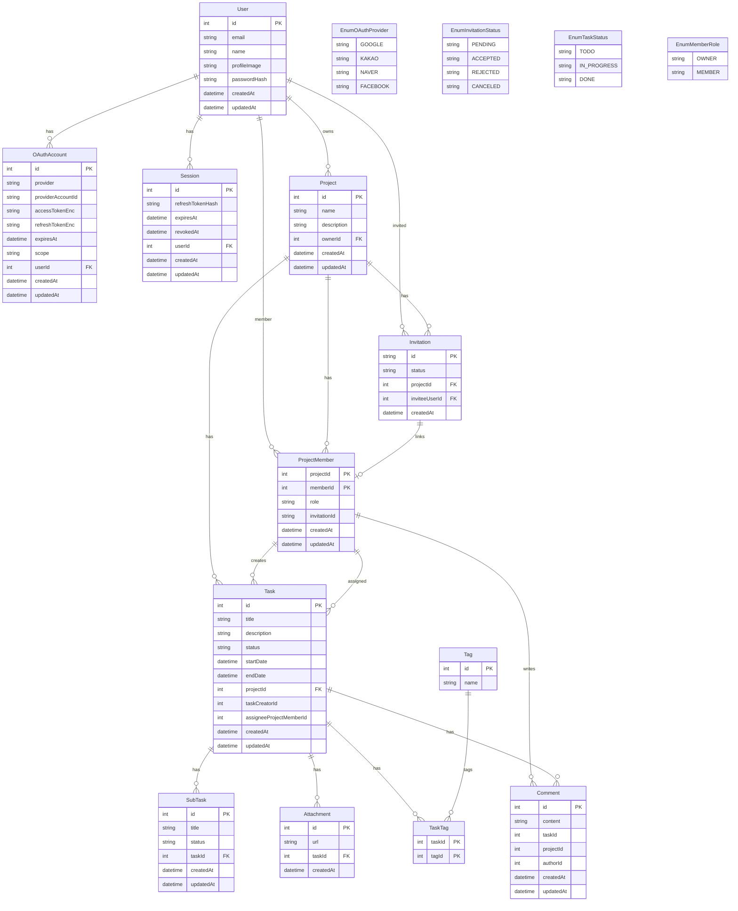

```mermaid
erDiagram
  User {
    int id PK
    string email
    string name
    string profileImage
    string passwordHash
    datetime createdAt
    datetime updatedAt
  }

  OAuthAccount {
    int id PK
    string provider
    string providerAccountId
    string accessTokenEnc
    string refreshTokenEnc
    datetime expiresAt
    string scope
    int userId FK
    datetime createdAt
    datetime updatedAt
  }

  Session {
    int id PK
    string refreshTokenHash
    datetime expiresAt
    datetime revokedAt
    int userId FK
    datetime createdAt
    datetime updatedAt
  }

  Project {
    int id PK
    string name
    string description
    int ownerId FK
    datetime createdAt
    datetime updatedAt
  }

  Invitation {
    string id PK
    string status
    int projectId FK
    int inviteeUserId FK
    datetime createdAt
  }

  ProjectMember {
    int projectId PK
    int memberId PK
    string role
    string invitationId
    datetime createdAt
    datetime updatedAt
  }

  Task {
    int id PK
    string title
    string description
    string status
    datetime startDate
    datetime endDate
    int projectId FK
    int taskCreatorId
    int assigneeProjectMemberId
    datetime createdAt
    datetime updatedAt
  }

  SubTask {
    int id PK
    string title
    string status
    int taskId FK
    datetime createdAt
    datetime updatedAt
  }

  Attachment {
    int id PK
    string url
    int taskId FK
    datetime createdAt
  }

  Tag {
    int id PK
    string name
  }

  TaskTag {
    int taskId PK
    int tagId PK
  }

  Comment {
    int id PK
    string content
    int taskId
    int projectId
    int authorId
    datetime createdAt
    datetime updatedAt
  }

    EnumOAuthProvider {
    string GOOGLE
    string KAKAO
    string NAVER
    string FACEBOOK
  }

  EnumInvitationStatus {
    string PENDING
    string ACCEPTED
    string REJECTED
    string CANCELED
  }

  EnumTaskStatus {
    string TODO
    string IN_PROGRESS
    string DONE
  }

  EnumMemberRole {
    string OWNER
    string MEMBER
  }


  User ||--o{ OAuthAccount : has
  User ||--o{ Session : has
  User ||--o{ Project : owns
  User ||--o{ Invitation : invited
  User ||--o{ ProjectMember : member

  Project ||--o{ Invitation : has
  Project ||--o{ ProjectMember : has
  Project ||--o{ Task : has

  Invitation ||--o| ProjectMember : links

  ProjectMember ||--o{ Task : creates
  ProjectMember ||--o{ Task : assigned
  ProjectMember ||--o{ Comment : writes

  Task ||--o{ SubTask : has
  Task ||--o{ Attachment : has
  Task ||--o{ TaskTag : has
  Tag  ||--o{ TaskTag : tags
  Task ||--o{ Comment : has
```
